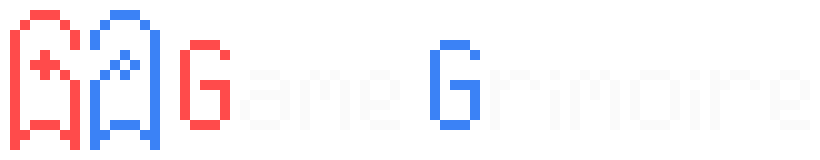

<a id="readme-top"></a>

<div align="center">
  <picture>
    <source media="(prefers-color-scheme: dark)" srcset="assets/logo-horizontal-white.png">
    <source media="(prefers-color-scheme: light)" srcset="assets/logo-horizontal-black.png">
    
  </picture>

  <p align="center">
    A local game collection manager. Track your backlog, log plays, and optionally pull metadata from IGDB or RAWG.
  </p>

  <p align="center">
    <a href="https://www.python.org/"></a>
    <a href="https://streamlit.io/"></a>
    <a href="https://www.sqlite.org/"></a>
    <a href="./LICENSE"></a>
  </p>
</div>

> **Personal project.** Built for my own use and shared as-is. Parts of this codebase were written with AI assistance. Expect rough edges.

---

<details>
  <summary>Table of Contents</summary>
  <ol>
    <li><a href="#about">About</a></li>
    <li><a href="#screenshots">Screenshots</a></li>
    <li><a href="#features">Features</a></li>
    <li>
      <a href="#getting-started">Getting Started</a>
      <ul>
        <li><a href="#prerequisites">Prerequisites</a></li>
        <li><a href="#installation">Installation</a></li>
        <li><a href="#running">Running</a></li>
      </ul>
    </li>
    <li><a href="#metadata-providers">Metadata Providers</a></li>
    <li><a href="#data-storage">Data Storage</a></li>
    <li><a href="#license">License</a></li>
  </ol>
</details>

---

## About

Game Grimoire is a Streamlit app that runs on your local machine. Your library lives in a local SQLite database (no accounts or cloud sync required).

Basic flow:

1. Add titles to your **Backlog**.
2. Pull cover art, genres, and release dates from IGDB or RAWG (optional).
3. Mark games as **Played** or **Abandoned** and log the year.
4. Search, filter by tags or duration, and sort.

---

## Screenshots


---

## Features

- **Backlog and history**: Separate views for games you plan to play and games you've finished or dropped, in card or table layout.
- **Tag system**: Built-in catalogue covering genres, themes, game modes, and age ratings. Tags have aliases that map provider labels to your local names. Custom tags supported.
- **Metadata enrichment**: Connect IGDB or RAWG to import covers, release dates, genres, and playtime. Both can be active at once, with configurable fallback priority.
- **Playtime tracking**: Log hours per game; the app estimates total backlog time from games with known durations.
- **Filtering and sorting**: Search by title, filter by tags (include/exclude), filter by duration (Short / Medium / Long), sort by title, hours, date added, or release date.
- **"Ready to play" flag**: Marks games as installed so you can filter to them quickly.
- **Export**: CSV, JSON, or raw SQLite backup.

---

## Getting Started

### Prerequisites

- Python 3.11+
- `pip`

### Installation

```bash
git clone https://github.com/YOUR_USERNAME/game-grimoire.git
cd game-grimoire

python -m venv venv

# Windows
venv\Scripts\activate
# macOS / Linux
source venv/bin/activate

pip install -r requirements.txt
```

### Running

**Windows:**
```bat
run.bat
```

**macOS / Linux:**
```bash
./run.sh
```

**Or directly:**
```bash
streamlit run src/app.py
```

Opens at `http://localhost:8501`.

---

## Metadata Providers

Optional. Configure in **Settings > Connections**.

| Provider | What you need | Where to get it |
|---|---|---|
| IGDB | Twitch Client ID + Secret | [dev.twitch.tv/console](https://dev.twitch.tv/console) |
| RAWG | API key | [rawg.io/apidocs](https://rawg.io/apidocs) |

Both can be active simultaneously. If the first returns no results, the second is used as fallback.

---

## Data Storage

| OS | Database path |
|---|---|
| Windows | `%APPDATA%\GameGrimoire\game_library.db` |
| macOS | `~/Library/Application Support/GameGrimoire/game_library.db` |
| Linux | `~/.local/share/GameGrimoire/game_library.db` |

Cover images are cached under `GameGrimoire/covers/`. The full database can be downloaded from **Settings > Export**.

---

## License

MIT. See [`LICENSE`](LICENSE).

<p align="right">(<a href="#readme-top">back to top</a>)</p>


